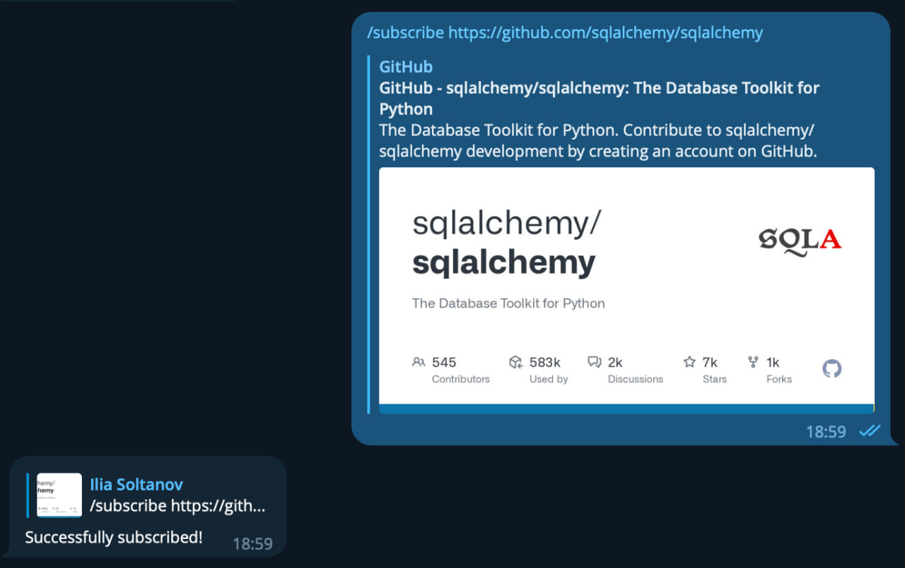
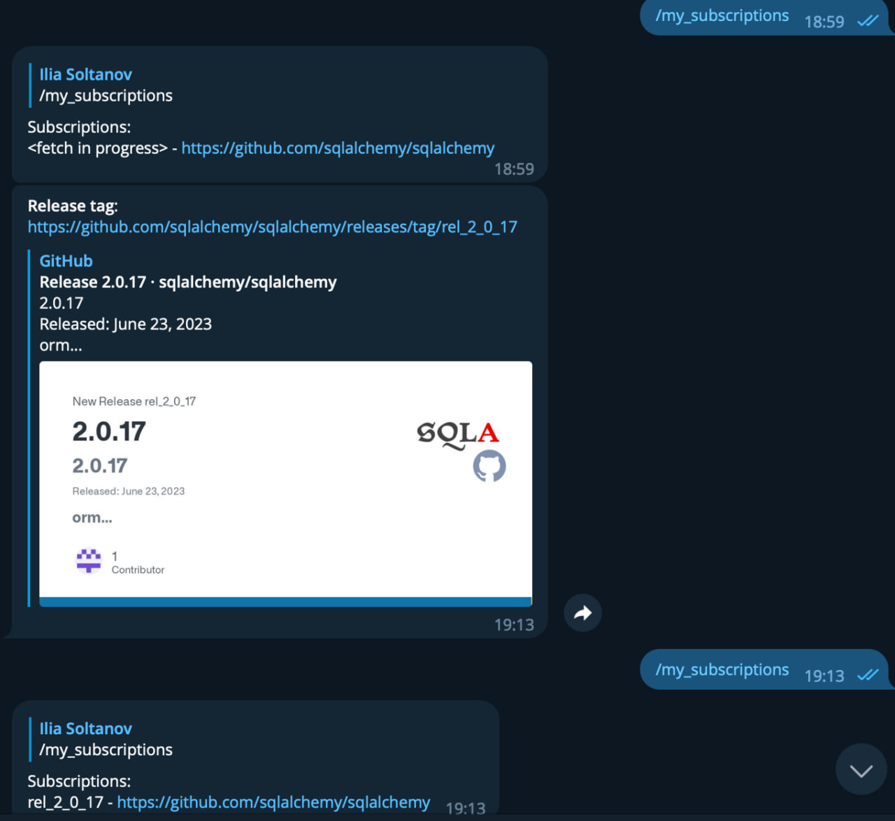

# GitHub Release Monitor bot

[](https://core.telegram.org/bots/api)
[](https://opensource.org/licenses/MIT)

Simple release monitor for GitHub repositories based on telegram bot.

You may try it on telegram - [here](http://t.me/github_release_monitor_bot) :)

## Command list

- `/help` - view all commands
- `/start` - base command for user registration
- `/my_subscriptions` - view all subscriptions
- `/subscribe` - \[GitHub repo urls] subscribe to the new GitHub repository
- `/unsubscribe` - \[GitHub repo urls] unsubscribe from the GitHub repository
- `/remove_all_subscriptions` - remove all exists subscriptions

<details><summary>Examples here</summary>
<code>/subscribe https://github.com/sqlalchemy/sqlalchemy</code>

FYI: bot will send you info about updates automatically.





</details>

## Config and environments variable

Config based on `.env` creation or set env-variables as you like (example: [.env.default](.env.default))

### `TELEGRAM_API_KEY`

- Find [BotFather](https://t.me/BotFather) account
- Create a new bot
- Generate API token and put it to config

### `SURVEY_PERIOD`

This parameter is used to set the polling frequency for all url addresses. Default 1 hour.

### `FETCHING_STEP_PERIOD`

This setting is used to set a timeout between each API request to prevent the rate limit from failing. Default 1 minute.

## How to run

### Without Docker:

- Make virtual environment
- Install package requirements
- Create `.env` or set env-variables as you like (example: [.env.default](.env.default))
- Run it

### With Docker

- Create `.env` or set env-variables as you like (example: [.env.default](.env.default)
  and see [docker-compose.yml](docker-compose.yml))
- Run it!

## Development tools

Makefile: [Makefile](Makefile)

### golangci-lint

[golangci-lint](https://github.com/golangci/golangci-lint) is a fast Go linters runner. It runs linters in parallel,
uses caching, supports yaml config, has integrations with all major IDE and has dozens of linters included.

Config: [.golangci.yml](.golangci.yml)

Run:

```shell
make lint
```

### gofumpt

[gofumpt](https://github.com/mvdan/gofumpt) - enforce a stricter format than gofmt, while being backwards compatible.
That is,
gofumpt is happy with a subset of the formats that gofmt is happy with.

Run:

```shell
make format
```

### gci

[gci](https://github.com/daixiang0/gci) - is a tool that controls Go package import order and makes it always
deterministic.

Run:

```shell
make format
```

## My subscriptions

- https://github.com/sqlalchemy/sqlalchemy
- https://github.com/soltanoff/github_release_monitor_bot
- https://github.com/python/cpython
- https://github.com/pylint-dev/pylint
- https://github.com/PyCQA/flake8
- https://github.com/john-hen/Flake8-pyproject
- https://github.com/pyupio/safety
- https://github.com/python-greenlet/greenlet
- https://github.com/aiogram/aiogram
- https://github.com/python-poetry/poetry
- https://github.com/sqlalchemy/alembic
- https://github.com/ultrajson/ultrajson
- https://github.com/MagicStack/uvloop
- https://github.com/encode/uvicorn
- https://github.com/tiangolo/fastapi
- https://github.com/aio-libs/aiohttp
- https://github.com/django/django
- https://github.com/encode/django-rest-framework
- https://github.com/pyca/cryptography
- https://github.com/pytest-dev/pytest
- https://github.com/nedbat/coveragepy
- https://github.com/redis/redis-py
- https://github.com/sparckles/robyn
- https://github.com/PyCQA/bandit
- https://github.com/litestar-org/litestar
- https://github.com/jd/tenacity
- https://github.com/aminalaee/sqladmin
- https://github.com/wagtail/wagtail
- https://github.com/zmievsa/cadwyn
- https://github.com/litestar-org/litestar-pg-redis-docker
- https://github.com/bigskysoftware/htmx
- https://github.com/Bogdanp/dramatiq
- https://github.com/jcrist/msgspec
- https://github.com/ijl/orjson
- https://github.com/PrefectHQ/prefect